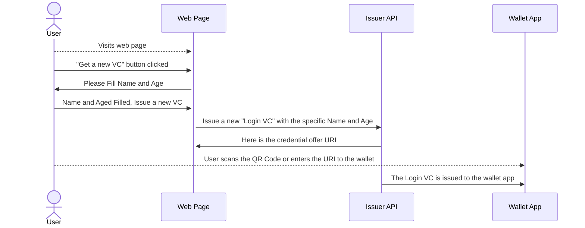
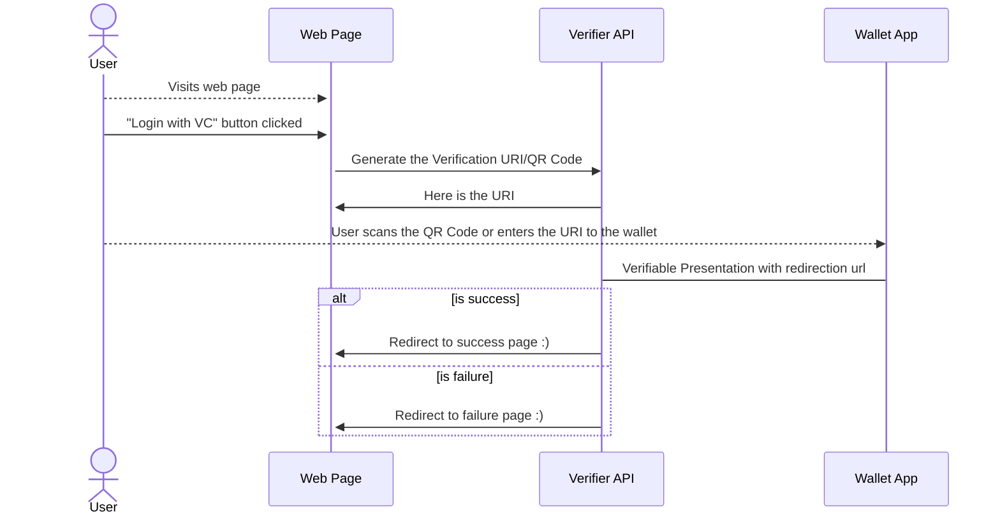

# web3-login

## Issue a new Login credential

```mermaid
  sequenceDiagram 
    actor User
    participant Web Page
    participant Issuer API
    participant Wallet App
    User-->>+Web Page: Visits web page
    User->>Web Page: "Get a new VC" button clicked
    Web Page->>User: Please Fill Name and Age
    User->>Web Page: Name and Aged Filled, Issue a new VC
    Web Page->>Issuer API: Issue a new "Login VC" with the specific Name and Age
    Issuer API->>Web Page: Here is the credential offer URI
    User-->>Wallet App: User scans the QR Code or enters the URI to the wallet
    Issuer API->>Wallet App: The Login VC is issued to the wallet app
```

## Login by using the Login credential

```mermaid
  sequenceDiagram 
    actor User
    participant Web Page
    participant Verifier API
    participant Wallet App
    User-->>+Web Page: Visits web page
    User->>Web Page: "Login with VC" button clicked
    Web Page->>Verifier API: Generate the Verification URI/QR Code
    Verifier API->>Web Page: Here is the URI
    User-->>Wallet App: User scans the QR Code or enters the URI to the wallet
    Verifier API->Wallet App: Verifiable Presentation with redirection url
    alt is success
        Verifier API->>Web Page:Redirect to success page :)
    else is failure
       Verifier API->>Web Page:Redirect to failure page :)
    end
```
